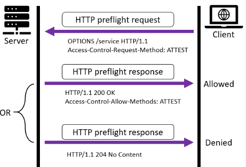
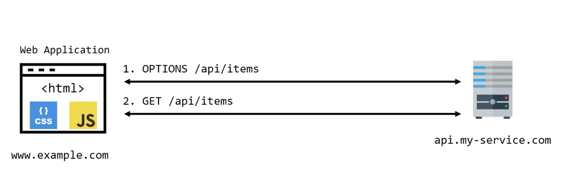
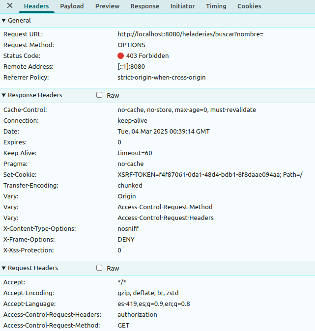
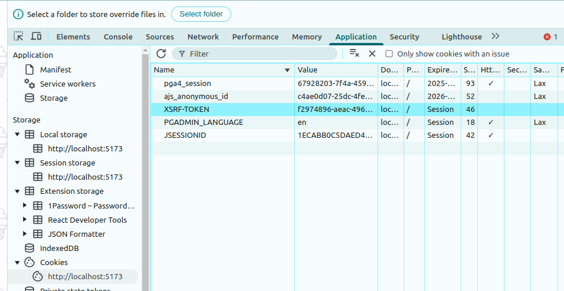

# Ejemplo Heladería

[](https://github.com/uqbar-project/eg-heladeria-springboot-kotlin/actions/workflows/build.yml) [](https://codecov.io/gh/uqbar-project/eg-heladeria-springboot-kotlin)

Este ejemplo está implementado con Kotlin y Spring Boot, se recomienda acompañarlo con el frontend desarrollado en [React](https://github.com/uqbar-project/eg-heladeria-react-phm).

Además necesitarás tener levantada una base de datos MySQL con un esquema llamado `heladeria`

```sql
drop schema if exists heladeria;
create schema if not exists heladeria;
```

Encontrarás:

- un modelo de datos compuesto por heladerías, que definen un mapa de gustos (strings) con dificultades de fabricación (integers)
- las heladerías pueden ser artesanales, económicas o industriales, implementadas con un enum
- hay además una relación many-to-one con su dueño

## Antes de ejecutarlo

Tenés que crearte manualmente un archivo `application-dev.yml` en el raíz del proyecto. Te dejamos un ejemplo:

```yml
server:
  port: 8080
spring:
  datasource:
    url: jdbc:postgresql://0.0.0.0:5432/heladeria?createDatabaseIfNotExist=true
    username: postgres
    password: postgres
  jpa:
    hibernate:
      ddl-auto: create-drop
    open-in-view: false
    properties:
      hibernate:
        format_sql: true
        show_sql: true
security:
  secret-key: <<escribí un hash sha2-256, character length 64, 256 bits>>
  access-token-minutes: 300
```

Para generar un secret-key podés ir a [esta página](https://www.browserling.com/tools/sha2-hash) y seleccionar un Output Hash Size de 512 bytes.

## Módulo de Seguridad

Esta aplicación utiliza Spring Security, de manera que cuando levanta la aplicación crea dos usuarios

- `dodain`, con el rol `admin` (password: `1234`)
- `phm`, con el rol `readonly` (password: `phm`)

Para usar la aplicación desde un cliente podés usar

- [Bruno (recomendado)](./Heladeria_Bruno.json)
- o [Postman](./Heladeria_Postman.json)

Primero tenés que loguearte con algún usuario y luego podés 

- ver la información de las heladerías, o de una heladería, o ver las personas que son dueñas de heladerías
- y si sos admin, podés agregar nuevos dueños o bien actualizar la información de una heladería

Para eso el login chequea las credenciales y devuelve luego un JWT (JSON Web Token) que nosotros almacenamos como variable para luego enviar en cada request.

Para más información podés ver [este apunte](https://docs.google.com/presentation/d/1fZw_wVdpESRp7xPIEy9jfBTOtypQLSvvahIldZ1cVBo/edit?usp=sharing).

## Configuración de seguridad

El archivo [HeladeriaSecurityConfig](./src/main/kotlin/org/uqbar/heladeriakotlin/security/HeladeriaSecurityConfig.kt) tiene todo lo que necesitamos configurar para la seguridad de la aplicación.

Vamos a continuación a contar cómo se implementa cada concepto:

### CORS

Cada página web suele necesitar recursos que están en distintos servidores. El backend es uno de esos recursos, entonces cada vez que nosotros queremos obtener información del servidor, entra en juego el mecanismo CORS (Cross-Origin Resource Sharing).

Cuando se trata de descargar

- imágenes,
- archivos css,
- código javascript,
- videos,

etc. no hay restricciones, desde cualquier cliente podemos acceder a cualquier dominio libremente. 

Pero cuando hacemos búsquedas o actualizaciones mediante bibliotecas como `fetch` o `axios`, que por debajo utilizan el objeto `XMLHttpRequest`, necesitamos que el server defina en qué orígenes (clientes) confía para responder a pedidos, para evitar que aplicaciones no autorizadas consulten o modifiquen información del sistema.

En los navegadores modernos esto se hace mediante una solicitud **preflight**, que verifica que el pedido se puede hacer. El cliente hace un pedido a través de un método `OPTIONS` y recibe como respuesta del servidor un header que indica si el pedido será aceptado o denegado.



En el header se envía el ok/no ok con la siguiente información:

- Access-Control-Allow-Origin: qué orígenes son aceptados (`*` indica que se acepta cualquier cliente)
- Access-Control-Allow-Methods: qué métodos HTTP son válidos para la URL solicitada
- Otros headers que podés investigar son: Access-Control-Allow-Credentials, Access-Control-Expose-Headers, Access-Control-Max-Age, Access-Control-Allow-Headers

Si tenemos el ok, el siguiente paso es hacer el pedido mediante el método http deseado (GET, PUT, POST, DELETE, PATCH):



### Anotación CORS vs. configuración custom

En otros ejemplos nosotros utilizamos la anotación `@CrossOrigin` en los controllers, para resolver automáticamente este inconveniente. Pero en este ejemplo nosotros necesitamos poder configurar CORS de manera más global:

- primero deshabilitamos CORS en el archivo HeladeriaSecurityConfig

```kt
@Bean
fun securityFilterChain(httpSecurity: HttpSecurity): SecurityFilterChain {
    return httpSecurity
        .cors { it.disable() }
        ...
```

Después habilitamos CORS para nuestro frontend (obviamente es solo para nuestra configuración local, no es para el ambiente productivo)

```kt
@Bean
fun corsConfigurer(): WebMvcConfigurer {
    return object : WebMvcConfigurer {
        override fun addCorsMappings(registry: CorsRegistry) {
            registry.addMapping("/**")
                .allowedOrigins("http://localhost:5173")
                .allowedHeaders("*")
                .allowedMethods("POST", "GET", "PUT", "DELETE")
                .allowCredentials(true)
        }
    }
}
```

Fijate que en allowedMethods tienen que estar todos los métodos http que ofrecés en los endpoints. Si sacamos por ejemplo el método GET, vas a ver que el preflight al buscar las heladerías va a tirar un 403 (Forbidden):



## Autenticación

### Endpoints autenticados y roles encargados

Vamos a definir ahora

- qué endpoints necesitan autenticación
- qué roles son los que pueden acceder a cada endpoint

Veamos el archivo HeladeriaSecurityConfig:

```kt
@Bean
fun securityFilterChain(httpSecurity: HttpSecurity): SecurityFilterChain {
    return httpSecurity
        ...
        .authorizeHttpRequests {
            // Queremos que cualquier persona se pueda loguear y mostrar errores
            // Importante: no definirlo solo para el method POST
            // porque CORS requiere que también puedas mandar el OPTIONS para hacer el pre-flight
            it.requestMatchers("/login").permitAll()
            it.requestMatchers("/error").permitAll()
            it.requestMatchers(HttpMethod.OPTIONS).permitAll()
            // Permisos de admin para modificar
            it.requestMatchers(HttpMethod.POST, "/heladerias").hasAuthority(ROLES.ADMIN.name)
            it.requestMatchers(HttpMethod.POST, "/duenios").hasAuthority(ROLES.ADMIN.name)
            it.requestMatchers(HttpMethod.PUT, "/heladerias/**").hasAuthority(ROLES.ADMIN.name)
                // Default: que se autentique para poder ver información
                .anyRequest().authenticated()
        }
```

Como vemos aquí, es importante

- que el login no requiera autenticación (para poder ingresar las credenciales que todavía no tenemos)
- que cualquier error que maneje Springboot no requiera autenticación, eso permite que no nos aparezca un 403 (Forbidden) si hay error en la autenticación
- que los métodos OPTIONS no requieran autenticación

Luego queremos que los métodos POST y PUT que producen efecto solo puedan ser manejados por administradores, mientras que cualquier usuario logueado (autenthicated) puede ver información de las heladerías.

### JSON Web Token

Cuando el cliente pasa las credenciales en el endpoint de login, el server le responde con un token, un hash que consiste en una serie de bytes que equivale a la firma digital en la que se certifica que somos tal o cual usuario.

Dentro del token almacenamos el usuario, el rol y también el momento en el que se vence el token y es necesario renovarlo. Por supuesto no está la contraseña:

- en clientes como POSTMAN, Bruno, etc. nosotros almacenamos el token en una variable para los próximos requests
- en el frontend lo podemos almacenar en el local storage, en el session storage (vive menos tiempo, cuando se vence la sesión se pierde el token mientras que en el local storage eso permite que cerremos y abramos el navegador y eventualmente mantengamos la sesión), o bien en una Cookie

Para devolver el token necesitamos un objeto que trabaje con la interfaz UserDetails de Spring Security:

```kt
@Bean
fun securityFilterChain(httpSecurity: HttpSecurity): SecurityFilterChain {
    return httpSecurity
        ...
        .httpBasic(Customizer.withDefaults())
        // agregado para JWT, si comentás estas dos líneas tendrías Basic Auth
        .addFilterBefore(jwtAuthorizationFilter, UsernamePasswordAuthenticationFilter::class.java)
        // fin agregado
```

- httpBasic permite capturar el header `Authorization` de cada request con el Bearer Token
- además tenemos inyectado como Bean al jwtAuthorizationFilter, que es el que termina de construir el token

```kotlin
@Component
class JWTAuthorizationFilter : OncePerRequestFilter() {

    @Autowired
    lateinit var tokenUtils: TokenUtils

    @Autowired
    lateinit var usuarioService: UsuarioService

    override fun doFilterInternal(
        request: HttpServletRequest,
        response: HttpServletResponse,
        filterChain: FilterChain
    ) {
        try {
            val bearerToken = request.getHeader("Authorization")
            if (bearerToken != null && bearerToken.startsWith("Bearer ")) {
                val token = bearerToken.substringAfter("Bearer ")
                val usernamePAT = tokenUtils.getAuthentication(token)
                usuarioService.validarUsuario(usernamePAT.name)
                SecurityContextHolder.getContext().authentication = usernamePAT
                logger.info("username PAT: $usernamePAT")
            }
            filterChain.doFilter(request, response)
        } catch (e: TokenExpiradoException) {
            // Captura la excepción de token expirado y devuelve el status code adecuado (401-Unauthorized)
            logger.warn(e.message)
            response.sendError(HttpStatus.UNAUTHORIZED.value(), e.message)
            return
        }
    }
}
```

Fíjense que aquí aprovechamos el header con la autorización que enviamos y

- buscamos que el usuario exista (solo eso, el token pertenece a un usuario pero no tiene contraseña)
- lo asignamos al contexto para definir a partir de aquí que se trata de un usuario autenticado
- en el caso de que el token se venció atrapamos la excepción y enviamos el status code adecuado (401-Unauthorized)

Podés investigar el archivo [TokenUtils](./src/main/kotlin/org/uqbar/heladeriakotlin/security/TokenUtils.kt) para que veas cómo se crea el token y como se obtiene la información del usuario en base al token.

## CSRF

El token no previene ataques XSS (Cross-site scripting) ni CSRF (Cross Site Request Forgery), que consisten básicamente en que código malicioso se haga pasar por el usuario actualmente logueado. Para eso necesitamos activar CSRF en Springboot, y lo hacemos desde el archivo de configuración nuevamente:

```kotlin
@Configuration
@EnableWebSecurity
class HeladeriaSecurityConfig {

    @Autowired
    lateinit var jwtAuthorizationFilter: JWTAuthorizationFilter

    @Bean
    fun securityFilterChain(httpSecurity: HttpSecurity): SecurityFilterChain {
        return httpSecurity
            ...
            .csrf {
                it.ignoringRequestMatchers("/login")
                it.csrfTokenRepository(CookieCsrfTokenRepository.withHttpOnlyFalse())
                it.csrfTokenRequestHandler(SpaCsrfTokenRequestHandler())
            }
            .build()
    }
```

Al activar CSRF lo que el server hace es enviar una Cookie con otro token, el XSRF-TOKEN que solo sirve para el usuario logueado.



Ese token viaja en una cookie que no tiene seteado el atributo SameSite (pero que por defecto es Lax, lo que significa que no va a viajar como información a ningún otro server). Y es responsabilidad del cliente

- recibir ese token
- y pasarlo en cualquier operación que tenga efecto (POST, PUT, PATCH si respetamos REST)

En el cliente Bruno eso es bastante molesto, en el frontend nuestro es relativamente sencillo una vez que parseamos la cookie.

Repasando la configuración que definimos anteriormente:

- el login no debe exigir token, por más que se trate de un POST
- las implementaciones que nosotros dejamos en el ejemplo son las recomendadas para Spring Security 6, donde a partir de esta versión se genera un token nuevo con cada request (para evitar la posibilidad de que se robe y reutilice)

